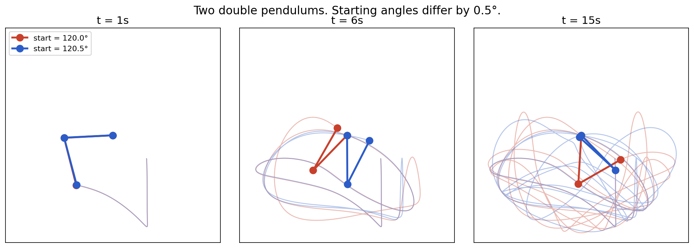
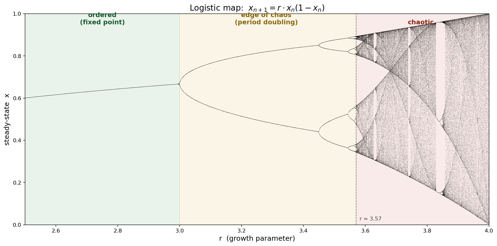
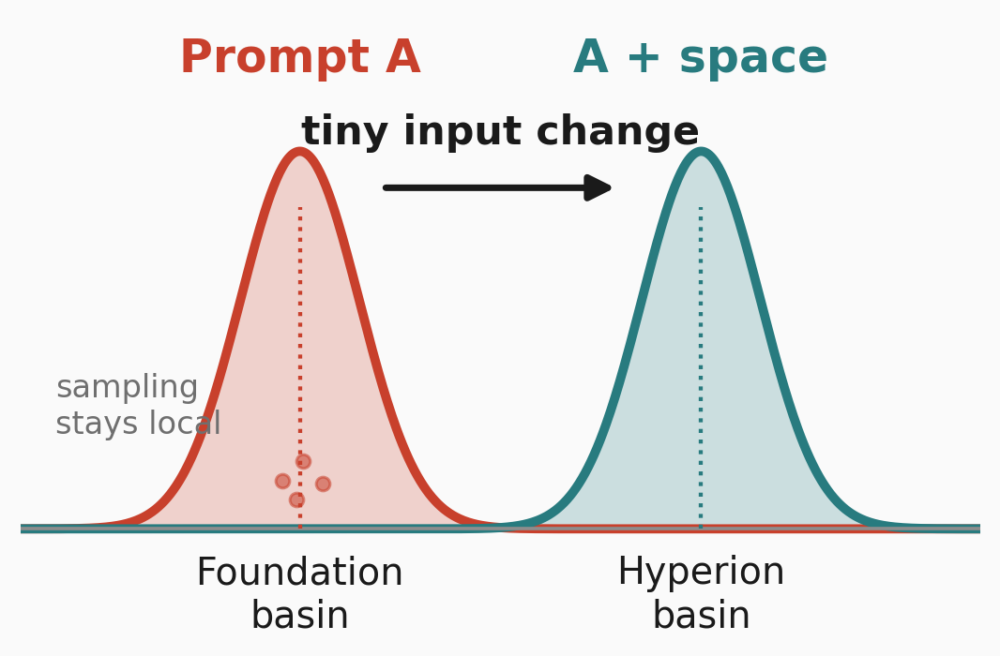

<!-- _class: title -->
<!-- _paginate: false -->
<!-- _footer: "" -->

# Nearby Prompts, Distant Trajectories

## Teaching a lens: chaos, dynamical systems, and how they *might* apply to LLMs.

<!--
Set the table. ~60 seconds.

"Most of you have heard of the butterfly effect. I want to teach you what's
actually under it — compounding, nonlinear divergence — and then walk through
how that lens MIGHT apply to the LLMs we work with. This is a Learning Club
talk: I'm teaching a lens, not defending a thesis. Some of what I tried
clicked. Some of it didn't. I'll show you both."

Tone: curious, not defensive. Exploratory, not a paper defense.
-->

---

## What I'm **not** claiming.

- **Not** "LLMs are chaotic." Classical chaos needs things LLMs don't have.
- **Not** "I measured a Lyapunov exponent." Token space is discrete.
- **Not** "bigger = more stable" or "reasoning = stable." Neither holds up.
- **Not** "sentence-embedding distance is ground truth." It's a proxy.
- **Not** "lower divergence = better." Stability is a property, not a score.

> Setting expectations. This is a Learning Club talk. I'm teaching a lens,
> not defending a paper.

<!--
~45 seconds. Lift the Q&A risk off the rest of the talk by disarming the
obvious objections up front. Everything I'm not claiming is something
someone in the room might otherwise object to later.

Say out loud: "If any of these would have been your objection — great, we
agree. I'm going to use chaos as a lens, show you where it seems to apply,
and tell you where the data got messy."
-->

---

## What I **am** claiming.

- LLMs aren't textbook chaotic systems — but at inference time they're **hybrid sequential systems:** continuous activations feed a **discrete branching process.**
- Small semantic or formatting changes can **move distributions** or **flip argmax branches.** The sensitivity is real, and **it varies a lot by model, prompt, and metric.**
- The naive way of measuring this has **specific failure modes** worth naming.
- Chaos vocabulary helps **organize** the phenomenon. It doesn't *prove* anything about LLMs.

> **Upshot:** treat prompting like operating a high-gain branching system.
> Test neighborhoods, not single prompts.

<!--
~60 seconds. This is the honest thesis. It's modest enough to defend and
interesting enough to teach. The "hybrid sequential system" framing is the
cleanest one a dynamicist won't fight — continuous activations, discrete
branching, finite-time sensitivity.

Operational line to repeat at the end: "test neighborhoods, not single
prompts."
-->

---

## Chaos isn't randomness.

**Chaos is deterministic amplification of small differences.**

- Same equations. Starting angles differ by **half a degree**.
- A few seconds later — totally different places.
- Not rolling dice. Magnifying what's already there.

> Weather forecasts aren't random. They're **sensitive**.

<!--
~60 seconds. Kill the pop-culture "chaos = chaotic = random" intuition
before any LLM content. Everyone in the room understands a pendulum.

Key line out loud: "Chaos is not randomness. Same input gives same output.
The trick is that NEIGHBORING inputs give wildly different outputs after
enough time. The system is deterministic — it just magnifies differences
faster than we can track."

Don't mention LLMs yet. Let the physics breathe.
-->

---

## Small differences grow. Measurably.

**Logistic map:** $x_{n+1} = r \cdot x_n (1 - x_n)$

- **Low r:** single value. **Mid r:** 2, 4, 8 cycles. **High r:** never repeats.

> **Lyapunov λ** — how fast nearby trajectories separate. λ > 0: chaotic.

Trained nets **sit near this boundary** (Langton 1990; Zhang 2024). *Which side is any LLM on?*

<!--
~90 seconds. This is the bridge slide — it earns you the rest of the talk.

The logistic map is the cleanest "deterministic iteration can produce any
regime" demonstration. Point at the bifurcation diagram and say: "same
equation, one knob. Turn it up, you get a phase transition into chaos."

Lyapunov introduced GENTLY — no formula on slide, just "measures how fast
trajectories separate." The actual formula |δ(t)| ≈ |δ(0)| · e^(λt) is in
speaker notes.

Edge-of-chaos citation is load-bearing — it's what makes "is this LLM near
the boundary?" a legitimate research question rather than a metaphor.
-->

---

## Same input. Same weights. Different output.

**Prompt A:** `Write a concise Python function that checks whether a string is a palindrome.`
**Prompt B:** same prompt, **trailing space added**. *(argmax decode — no sampling.)*

<strong style="color:#c8402c">Output A — OLMo-3 7B</strong>
<pre><code>def is_palindrome(s: str) -&gt; bool:
    """
    Check if the given string
    is a palindrome, ignoring
    case and non-alphanumeric
    characters.
    ...
    """
    cleaned = ''.
</code></pre>

<strong style="color:#c8402c">Output B — OLMo-3 7B</strong>
<pre><code>Certainly! Here's a concise
Python function to check if a
string is a palindrome:

    def is_palindrome(s: str):
        return s == s[::-1]

How it works: ...
</code></pre>

<!--
Real data. Same weights, argmax decode, only the trailing space changed.

"This shouldn't produce two different essays. But it does. This is the puzzle
the rest of the talk explains — and before anyone asks 'is this just
temperature,' the next slide separates those two ideas."

Pre-empt: argmax decoding has no sampling step, so seed is inert. That
means what you see here is not 'the model got unlucky' — it's the model's
most confident response under one input vs. its most confident response
under the other. The distribution itself moved.

Don't dunk on OLMo. Other models do this too. This is an existence proof.
-->

---

## This isn't just temperature.

|  | **Same prompt** | **Tiny prompt change** |
|---|---|---|
| **Temp = 0** (argmax) | Byte-identical. Boring. | **★ this is what the talk measures** |
| **Temp > 0** (sampling) | Different draws, same vibe. | Different draws **and** different vibe. Confounded. |

> **Temperature:** from a fixed distribution, what token do we sample?
> **Sensitivity:** how far did the distribution itself move?

Starred cell = our probe: zero sampling noise, output still moves. The model's response *function* shifted.

*(At T=0.7 on OLMo-3, within-prompt and between-prompt sampling distances can match in magnitude — deterministic decode is the only setting where the signal isn't drowned out.)*

<!--
This slide is the pedagogical linchpin. ~2 minutes.

The audience has a ChatGPT-shaped intuition: "LLMs are random, that's
temperature." That intuition collapses two different phenomena. Break them
apart here or they'll re-collapse them during Q&A.

Weather analogy: forecasts aren't random. They're SENSITIVE. Change the
initial conditions by 0.1 degrees and a week later the forecast is
completely different — not because weather is stochastic, but because the
system amplifies small input changes. Same claim, for LLMs.

One-line hook to repeat twice during the talk:
"Temperature samples from a distribution. Sensitivity asks how far the
distribution moved."
-->

---

## So: is an LLM a dynamical system?

- It has **state** (hidden activations, logits, KV cache, prefix).
- It has **iteration** (each token feeds into the next).
- It's **deterministic** under argmax.
- Small input perturbations can produce large output changes.

That's the checklist. The remaining question is whether the *magnitude* of
amplification is interesting — and whether we can measure it.

> But there's a catch: classical chaos needs perturbations going to zero.
> Token space is discrete. We'll come back to this.

<!--
~60 seconds. This slide is much shorter than before — the chaos background
already happened on the last two slides. This one's job is just to bridge:
"LLMs check every box on the dynamical-systems checklist."

The catch line matters: discrete token space means |δ| → 0 doesn't cleanly
work. Flag it now, resolve it later on the "meaning-preserving perturbation"
slide.
-->

---

## Both outputs can be correct.

> A double pendulum isn't "wrong"; it obeys physics and lands elsewhere.
> Same bar for LLMs.

- "Book like *Dune*" → Foundation. Add a trailing space → Hyperion.
- Both recommendations are defensible; neither is a hallucination.
- Sampling stays local; sensitivity can **move the distribution**.
- **Measure:** divergence per unit of *meaning-preserving* input change.

<!--
This is the slide that answers "is this just regeneration noise?" without
having to argue it. You show two equally valid outputs, not one correct
and one broken, and the audience gets it.

The "put NOT at the front" trap: big semantic tokens move the output a lot
because they SHOULD — you changed the meaning. That's the model working,
not the model being sensitive. The interesting quantity is output-move /
input-move, conditioned on input-move being small.

Li et al. hedge: classical Lyapunov needs |δ| → 0. In continuous activation
space you can take that limit (they do). In discrete token space you can't.
So we either (a) restrict to meaning-preserving perturbations, or (b) move
the probe into activation space. Both are open extensions with compute.
-->

---

## State, and prior work — short version

An LLM's "state" is hidden activations + logits + prefix + KV cache. *How much does the output distribution move when the input changes a little?*

People have started probing this:

- **Li et al. 2025** — QLE-style analysis on Qwen2-14B. Magnitudes grow ~1.32× per layer; shallow layers contract, deep layers amplify. They call it *quasi*-Lyapunov (finite depth, not a fixed map).
- **Geshkovski et al. 2023** — self-attention as interacting-particle dynamics.
- **Poole / Schoenholz** — edge-of-chaos signal propagation in deep nets.

> The chaos math is cleanest in **activation space**.
> What I measure is the downstream shadow at the **output-text level**.

<!--
Combined state + prior art. ~90 seconds.

Li et al. key numbers to land: 1.32× per-layer magnitude growth in layers 0–9;
MLP contributes 55.8% of final residual, attention 44.2%, initial input 0.0009%.
That last number is the chaos-in-one-line: we're perturbing the 0.0009% and
watching the 100% move.

Honest framing: Li et al. ran ONE model (Qwen2-14B), defined an iterative
(token-level) QLE but never computed it, and never compared models. I run 18
models on the axis they didn't: token-level. Complementary, not redundant.
-->

---

## The experiment

- **~18 models:** Qwen (0.8B → 9B), Gemma 4, Phi-4, DeepSeek-R1, Mistral,
  Granite, Falcon, SmolLM, OLMo 2 & 3; legacy: GPT-2 XL, GPT-J, Pythia, OPT, LLaMA-1.
- **Prompt ladder:** identical / no-op formatting / punctuation / synonym /
  paraphrase / small semantic / positive control.
- **Deterministic decode** (`do_sample=False`, argmax) — divergence is a shift in the model's most confident response.
- **Metrics:** sentence-embedding cosine distance (primary) + token edit +
  hidden-state distance + logit KL. All proxies; no ground truth.
- **Analysis:** bootstrap CIs + paired permutation tests. Present clusters, not ranks.
- **Reproducibility:** pinned HF revisions, bf16, chat templates disabled, config published with artifacts.

<!--
Lay out methodology cleanly. Anticipate methods questions.

Critical control: same prompt + deterministic decode = 0.000 divergence.
Same prompt + sampling = high divergence. Sampling controls are why
deterministic decode is the right first probe.

Cap n honestly: 21 prompt pairs in the panel; a hardened Qwen wave went to 42.
Save the punchlines for next slide.
-->

---

## Within-Qwen: one clean contrast.

**n = 24 prompt pairs, same family** (controls for pretraining + architecture):

| Model | Mean | 95% CI | vs 4B (p) |
|---|---:|---:|---:|
| Qwen3.5 **4B**   | 0.034 | [0.018, 0.053] | — |
| Qwen3.5 **9B**   | 0.037 | [0.016, 0.061] | 0.78 |
| Qwen3.5 **2B**   | 0.073 | [0.039, 0.115] | **0.012** |
| Qwen3.5 **0.8B** | 0.089 | [0.048, 0.137] | **<0.001** |

- 0.8B is **meaningfully more sensitive** than 4B within the same family.
- 4B vs 9B: indistinguishable at this n — **not claiming "bigger = stable."**
- Caveat: 4B/9B emit `Thinking Process:` preambles. Scaffold confound, next slide.

<!--
This was my single cleanest finding yesterday. Then I looked at the raw
generations. Qwen 4B/9B start every answer with an identical reasoning
scaffold. That scaffold inflates common prefix and suppresses early
semantic distance. The capacity-vs-sensitivity story in this slide is
real but partly confounded — I'll own that in the next two slides instead
of burying it.
-->

---

## Scaffold "stability" is mostly metric artifact.

**Short outputs (64 tokens):** scaffolded models look ~4× more stable.
Identical `<think>` preambles dominate sentence-embedding similarity.
**Warning about evaluation — not a claim about model dynamics.**

**Long outputs (512 tokens) expose the mixed bag:**

| Scaffolded model | 512-tok semantic | Prompt-end top-1 prob |
|---|---:|---:|
| DeepSeek-R1 7B | 0.027 (stable) | 0.99976 |
| Qwen 4B / 9B | 0.050 / 0.057 | 0.970 / 0.988 |
| SmolLM3 3B | 0.080 (middle) | 0.99983 |
| **Phi-4 reasoning+** | **0.160 (brittle)** | **0.99999996** |

**Phi-4:** certain at the prompt, chaotic at 512 tokens. Scaffold adherence ≠ content robustness. Qwen thinking-off control: small effect, not monotonic — scaffold helps big Qwens a bit, *hurts* Qwen 0.8B.

<!--
This is the scaffold slide after the 512-token rerun. Keep the short-output
finding — it's what a naive probe would report — but land the fact that
longer outputs expose scaffolded models as a mixed bag.

Phi-4 is the crown-jewel counterexample:
- visible <think> scaffold
- top-1 probability 0.99999996 at prompt end (most confident in panel)
- JS divergence 1.4e-9 (bulk distribution didn't move)
- 512-token semantic 0.160 (more brittle than GPT-2 XL)

That is the single cleanest dissociation between "confident logits" and
"stable trajectory" in the whole dataset.

Thinking-off numbers (Qwen default vs enable_thinking=False):
  4B: 0.050 → 0.067 (scaffold helps ~25%)
  9B: 0.057 → 0.072 (scaffold helps ~20%)
  2B: 0.075 → 0.072 (wash)
  0.8B: 0.103 → 0.079 (scaffold HURTS — scaffold in small model is noisy)

So the scaffold is real but not monotonic. Don't overclaim either direction.
-->

---

## Era, recipe, and the LLaMA-1 surprise

**512-token semantic distance, non-scaffold models only:**

| Model | Semantic | Era |
|---|---:|---|
| **LLaMA-1 7B** | **0.053** | 2023 base — stable outlier |
| Gemma E2B **instruct** | 0.056 | modern chat |
| Mistral 7B v0.3 | 0.068 | modern chat |
| Gemma E4B **instruct** | 0.072 | modern chat |
| Gemma E4B **base** | 0.119 | modern base |
| Gemma E2B **base** | 0.199 | modern base |
| GPT-2 XL / OPT / Pythia / GPT-J | 0.14 – 0.22 | pre-chat base |

**LLaMA-1 is content-stable without a scaffold.** Within Gemma, **instruct ≫ base** — recipe, not calendar. Era alone does not predict sensitivity; token-path and semantic metrics can even point different ways.

<!--
512-token numbers from runs/rankings/scaffold_long_wave/small_perturbation_bootstrap.csv.

Key updates vs earlier slide:
- Gemma E2B and E4B base actually *swap* order between the 64-token panel
  and the 512-token panel. Good talking point if asked: "stability is a
  scale-dependent measurement, which is why we report clusters not ranks."
- LLaMA-1 actually beats Gemma E2B it by a hair on 512 tokens. Still in the
  stable band. Don't overclaim against one community conversion.
- Qwen 4B/9B removed from this slide because they're scaffolded; they live
  on the scaffold slide now.

If pushed on "is LLaMA-1 real": possible explanations — pretraining corpus,
tokenizer, or just a community-conversion artifact. One data point, treat as
a flag not a law.

Follow-up on the "older models more stable?" hunch:
at token edit distance around t=60, modern/instruct models look slightly more
surface-divergent than legacy/base models. At 512-token semantic distance,
the sign flips: modern/instruct models are more semantically contractive.
So this slide is about recipe and metric choice, not calendar year.
-->

---

## Stability isn't responsiveness.

> A model that outputs `"the the the"` regardless of input is extremely
> stable. So is a model collapsed onto one fixed answer. **Neither is what
> we want.**

One thing I tried: **sweep Qwen through BF16 / 8-bit / 4-bit quantization.**
Qwen 0.8B at 4-bit scored *lower* perturbation divergence (0.138 → 0.091) —
which sounds like "more stable" until you check its drift from BF16 on
identical prompts (**0.132 — huge**).

Consistent with collapse onto a narrower output manifold, not robustness.
A naive stability metric **can't tell a robust model from a collapsed one.**

> **Fix:** always pair perturbation distance with drift-from-baseline. Both axes, not one.

<!--
Collapsed the old two quant slides into one conceptual point. The numbers
are exploratory (n=9), so don't oversell them — the POINT is the principle:
a one-axis stability metric can confuse collapse with robustness. That's
the scientifically useful takeaway regardless of whether the Qwen 0.8B data
is itself definitive.

If pushed on whether the quant finding is solid: "this was n=9 per cell, and
the within-system flip is p=0.19. Treat it as an existence example of the
collapse confound, not a quantization conclusion."
-->

---

## Measuring is the hard part.

**Three ways a naive stability probe will mislead you:**

| Confound | What happens | Caught by |
|---|---|---|
| **Collapse** | Degenerate model scores "stable" because outputs stop responding to input. (Qwen 0.8B 4-bit.) | Distance from baseline on identical prompts. |
| **Scaffold** | Short-output score dominated by deterministic preamble. (Qwen 4B/9B, SmolLM3.) | Longer continuations; scaffold stripping. |
| **Confident ≠ stable** | Low prompt-end JS + sharp top-1 argmax doesn't mean trajectory is stable. **Phi-4 is certain at prompt-end and brittle at 512 tokens.** | Multi-scale measurement: short vs long, logit vs text. |

> The most useful contribution of this work isn't the numbers.
> **It's naming the failure modes before the field starts quoting the numbers.**

<!--
Third row is new. Phi-4 is the cleanest single counterexample in the data:
top-1 probability 0.99999996 at prompt end, visible <think> scaffold, and
the second-most brittle model in the panel at 512 tokens (0.160 — above
GPT-2 XL at 0.144). Sharp-logit ≠ stable-trajectory.

If someone asks "what's the fix": the mature version is multi-scale. Short
outputs can be dominated by scaffolds. Prompt-end logits can miss
decision-boundary fragility. No single measurement is safe alone.
-->

---

## Long-generation trajectories

Early growth, then saturation as outputs enter different textual basins. DeepSeek-R1 keeps a 138-token shared prefix on a punctuation-only perturbation.

<!--
Don't force exponential framing if the curves look piecewise linear.

Key visual: Qwen 0.8B branches almost immediately on punctuation/synonym;
Qwen 4B branches later; DeepSeek keeps long shared prefixes and often
reconverges semantically even when token paths diverge.

"This is where 'dynamical regime' stops being a metaphor. Different models
have visibly different divergence shapes under the same perturbation."
-->

---

## Mechanism: boundary beats bulk

**Cross-model correlations with 512-token semantic divergence** (n=20):

| Logit signal at prompt-end | Pearson r | Reads as |
|---|---:|---|
| Top-1 probability | **−0.84** | more confident next-token → less downstream drift |
| Top-1 flip rate | +0.57 | argmax crossings predict later divergence |
| Top-1 margin (logit) | −0.39 | weaker but same direction |
| Full-vocab JS divergence | −0.10 | **bulk distribution shift doesn't predict anything** |

> Small prompt change → argmax crosses a low-margin boundary → different first token → autoregressive feedback → different trajectory.

**The distribution often isn't moving much in bulk.** It's that a low-margin next-token decision is fragile, and one flipped argmax steers the generation into a different basin.

<!--
This is the mechanism slide. Say out loud:

"If you took one thing from the measurement side of this talk: it's not that
the whole next-token distribution shifts. It's that some next-token decisions
are made at very low margin. A tiny input perturbation crosses that boundary,
flips the argmax, and the model is now generating from a different starting
token. Autoregression does the rest."

Phi-4 is the extreme case in the next slide: prompt-end top-1 probability
0.99999996 (the model is *certain*), JS ~1.4e-9 (distribution hasn't moved
at all), yet 512-token semantic divergence is 0.160 — higher than GPT-2 XL.
Prompt-end confidence says nothing about trajectory stability on its own.
-->

---

## A question the lens suggests (not a claim).

### Static floor
How few bits to store the model?
- TurboQuant, KIVI, KV quantization.
- Rate-distortion bounds.
- Well-characterized.

### Dynamical floor?
How few bits before *behavior* drifts?
- Might depend on model sensitivity.
- Stable models *might* tolerate more compression.
- **Open. My data doesn't settle it.**

> Compression has a static floor. Does it have a *dynamical* one too?
> The chaos lens suggests the question. I don't have the answer.

<!--
Softened from "two floors" conjecture to "a question the lens suggests."
This matches the teaching-lens framing — we're raising interesting questions,
not defending theorems.

If someone asks "do you believe it?": "I lean yes, but my own data has the
Qwen 0.8B collapse case that would naively falsify the claim. So: open
question I'd love someone else to chase."
-->

---

## The practitioner upshot.

> **Don't evaluate on a single prompt, single decode, or single metric.
> Prompting is operating a high-gain branching system.**

**Operational:**
- **Reliability:** test prompt *neighborhoods*, not one canonical prompt.
- **Model comparison:** report sensitivity *ranges* over equivalent prompts.
- **Output metrics:** strip boilerplate, compare answer spans, watch prefixes.
- **Decoding:** deterministic for sensitivity; sampling separately for deployment.
- **Quantization:** lower divergence ≠ robustness. Also check baseline drift.

> **The chaos lens doesn't prove anything about LLMs. It suggests questions
> that benchmarks don't ask — and those questions are worth asking.**

<!--
Land and stop. This is the honest teaching-lens closing.

"If you remember one thing: prompting is operating a high-gain branching
system. Test neighborhoods, not single prompts. Watch for the confounds
when you score stability. That's it."
-->

---

<!-- _class: big-quote -->

# Questions?

<!-- Go to backup slides if asked about methods, specific models, or failures. -->

---

## Backup — "Would I get the same answer if I ran it?"

**Argmax decode has no sampling step.** `do_sample=False` → highest-logit token wins each step. Seed is inert.

- Same prompt twice → byte-identical output.
- Prompt A vs B → top-token at some position **flipped**. Most confident response moved.

**Temperature > 0?** 30-sample cluster test (OLMo-3, palindrome pair, T=0.1):

- Prompt A: 30 samples cluster tightly. Prompt B: same.
- A-cluster and B-cluster are visibly separate.

Not "got unlucky once" — two different attractors. Sampling noise smaller than the shift between them.

---

## Backup — "Is this chaos?" defense

- Formal chaos needs exponential divergence under iteration. **Not proven.**
- What was measured: small input perturbations producing different outputs,
  varying by model, reproducible under deterministic decode.
- Consistent with behavior near a chaos boundary. Not a proof of chaos.
- The frame is the contribution; the experiment is a probe, not a theorem.

---

## Backup — Related work I came across late

**Prompt sensitivity / brittleness:**
- **Salinas & Morstatter 2024** — "Butterfly Effect of Altering Prompts." My whitespace example, already published.
- **Sclar et al. 2023** — formatting sensitivity; up to 76-point swings on LLaMA-2-13B.
- **Lu et al. 2021** — example ordering alone moves few-shot near-random to near-SOTA.
- **PromptRobust / POSIX / RobustAlpacaEval** — published sensitivity benchmarks.

**Dynamical systems in NNs:**
- **Poole 2016 / Schoenholz 2017** — edge-of-chaos signal propagation.
- **Geshkovski et al. 2023** — attention as interacting-particle dynamics.
- **Tomihari & Karakida 2025** — Jacobian/Lyapunov analysis of self-attention.

---

## Backup — Statistical honesty

- **n = 9** prompt pairs per model; **n = 24** in hardened Qwen wave. Small.
- **Robust at n = 24:** Qwen 4B vs 0.8B p<0.001; Qwen 4B vs 2B p=0.012; cluster membership.
- **Not robust at this n:** Qwen 4B vs 9B (p=0.78); middle-pack ordering; standalone quant flip.
- Scaffold vs non-scaffold is **confounded with post-training recipe** — needs different *models*, not more prompts.

> If you want to disagree with "stable cluster vs brittle cluster" you need
> 100+ prompts. If you want to disagree with specific model orderings —
> you're already right, I'm not claiming them.

---

## Backup — Failed experiments

- **gpt-oss-20b:** MXFP4 / Triton driver mismatch on SageMaker image.
- **Nemotron Nano 9B v2:** container lacked `mamba-ssm`.
- **Phi-4 mini:** Transformers version / custom-code import failure.

Reported as tooling misses, not stability findings.

---

## Backup — Full bootstrap readout (512 tokens)

**Stable / mid**

| Model | Mean | 95% CI |
|---|---:|---:|
| DeepSeek-R1 Qwen 7B | 0.027 | 0.018 – 0.036 |
| Qwen3.5 4B | 0.050 | 0.033 – 0.066 |
| LLaMA-1 7B | 0.053 | 0.017 – 0.100 |
| Gemma 4 E2B it | 0.056 | 0.033 – 0.080 |
| Qwen3.5 9B | 0.057 | 0.037 – 0.075 |
| Mistral 7B v0.3 | 0.068 | 0.047 – 0.089 |
| Gemma 4 E4B it | 0.072 | 0.038 – 0.110 |
| Qwen3.5 2B | 0.075 | 0.050 – 0.103 |

**Higher sensitivity / caveats**

| Model | Mean | 95% CI |
|---|---:|---:|
| OLMo 2 7B | 0.088 | 0.055 – 0.127 |
| Qwen3.5 0.8B | 0.103 | 0.061 – 0.153 |
| OLMo 3 7B | 0.104 | 0.077 – 0.135 |
| Gemma 4 E4B base | 0.119 | 0.071 – 0.173 |
| GPT-2 XL | 0.144 | 0.082 – 0.208 |
| **Phi-4 reasoning+** | **0.161** | 0.072 – 0.255 |
| Gemma 4 E2B base | 0.199 | 0.152 – 0.248 |

n=24 pairs, 512 tokens. Clusters, not ranks. **Phi-4: scaffolded yet brittle** — scaffold ≠ stable.
